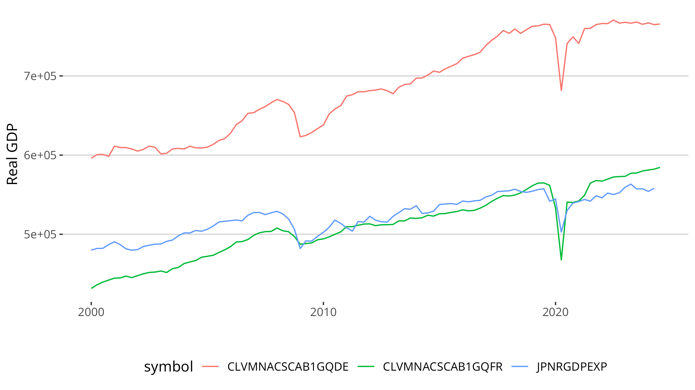

# FredApi (R package)


`FredApi` offers the possibility to access the [FRED Developer API](https://research.stlouisfed.org/docs/api/) in R.
This package was originally written for julia as [FredApi.jl](https://github.com/markushhh/FredApi.jl).

## Installation

```@R
pak::pak("markushhh/FredApi")
devtools::install_github("markushhh/FredApi")
#install.packages("FredApi") # not (yet?) supported
```

## Tutorial

Download a full dataset with

```R
get_symbols("GDPC1")
```

output

```R
> get_symbols("GDPC1")
# A tibble: 311 × 3
   date       symbol values
   <date>     <chr>   <dbl>
 1 1947-01-01 GDPC1   2183.
 2 1947-04-01 GDPC1   2177.
 3 1947-07-01 GDPC1   2172.
 4 1947-10-01 GDPC1   2206.
 5 1948-01-01 GDPC1   2240.
 6 1948-04-01 GDPC1   2277.
 7 1948-07-01 GDPC1   2290.
 8 1948-10-01 GDPC1   2292.
 9 1949-01-01 GDPC1   2261.
10 1949-04-01 GDPC1   2253.
# ℹ 301 more rows
# ℹ Use `print(n = ...)` to see more rows
```

## Plotting example

```@R
data <- 
  search_symbol("Real Gross Domestic Product") |>
  dplyr::filter(
    title |> stringr::str_detect("Germany") |
    title |> stringr::str_detect("France") |
    title |> stringr::str_detect("Japan")
  ) |>
  head(3) |>
  dplyr::select(id) |>
  dplyr::pull() |>
  get_symbols() 
  
data |> 
  dplyr::filter(date >= lubridate::ymd("2000-01-01")) |>
  ggplot2::ggplot() +
  ggplot2::geom_line(ggplot2::aes(date, values, col = symbol)) +
  ggthemes::theme_hc() + 
  ggplot2::xlab("Time") +
  ggplot2::ylab("Real GDP")
ggplot2::ggsave("plot.png", width = 16, height = 9)
```



# Each comment, suggestion or pull request is welcome!